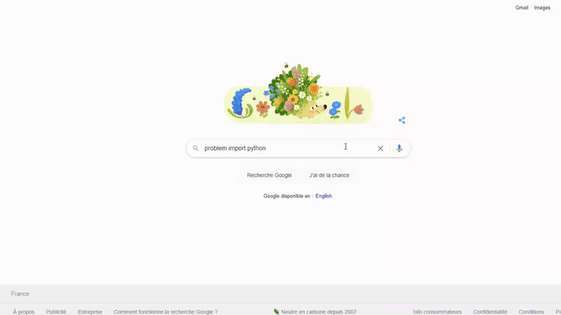

# StackOverflowAnswer

<h4 align="center">Chrome Extension to quickly get StackOverflow answers from a google search</h4>

  <a href="#Features">Features</a> |
  <a href="#License">License</a> |
  <a href="#Contact">Contact</a> | 
  <a href="https://ronanren.github.io" target="_blank">My Portfolio</a> 

# Features

- 🌎 Get answer on every StackOverflow instantly
- ⌛ Fast extension to display the data
- 🔘 Button on each StackOverflow topic to display the answer
- 🔗 Available on <a href="">Extension Chrome</a>

    

# License

<a href="https://github.com/ronanren/StackOverflowAnswer/blob/main/LICENSE" target="_blank">MIT</a>

# Contact

**Twitter** : <a href="https://twitter.com/Ronanren" target="_blank">@Ronanren</a>